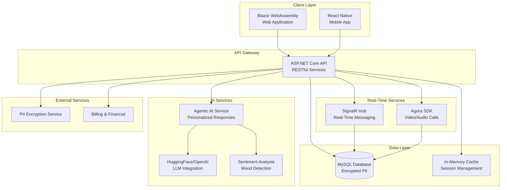
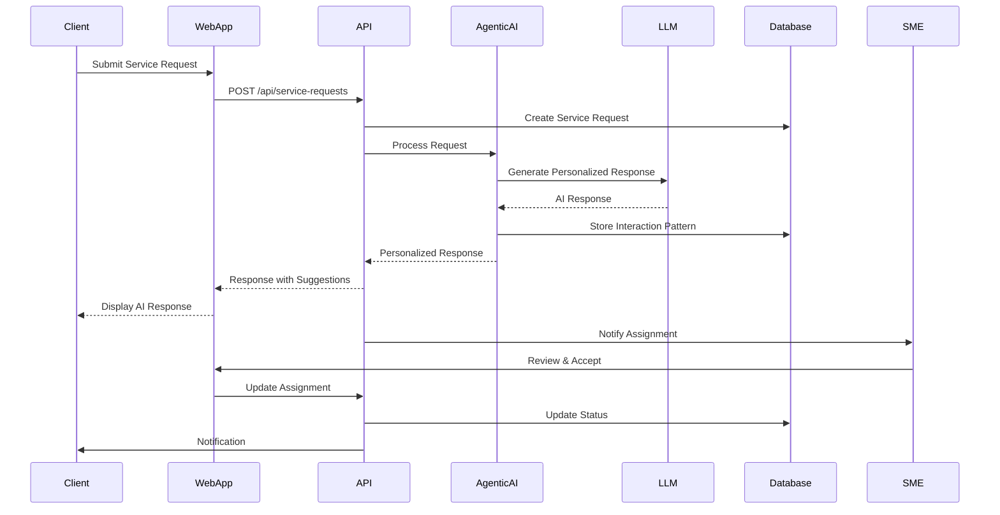

# Marketing Materials - Customer Care Portal

## Product Overview

**Customer Care Portal** is an AI-powered, comprehensive platform designed to streamline service request management, enhance client-provider communication, and deliver personalized support through intelligent automation.

---

## 1. Architecture Diagram

### System Architecture (Mermaid Format)

### User Flow Architecture

---

## 2. Key Features & Capabilities

### 🎯 Core Features

#### **1. Agentic AI Assistant**
- **Personalized Communication**: Learns from each client interaction to adapt communication style
- **Sentiment Analysis**: Detects emotional state and urgency from messages
- **Context-Aware Responses**: Understands service request context and provides relevant suggestions
- **Learning System**: Continuously improves responses based on client feedback patterns
- **Multi-Modal Support**: Handles text, voice, and structured data inputs

#### **2. Service Request Management**
- **End-to-End Workflow**: From request creation to completion
- **Intelligent Assignment**: AI-powered SME matching based on expertise, location, and availability
- **Client Preferences**: Respects and prioritizes client-requested providers
- **Status Tracking**: Real-time updates on request progress
- **Multi-Service Support**: Handles various service types (plumbing, legal, medical, etc.)

#### **3. Real-Time Communication**
- **Live Chat**: SignalR-powered instant messaging between clients and SMEs
- **Video Consultations**: Agora SDK integration for HD video calls
- **Audio Calls**: High-quality voice consultations
- **Call Management**: Incoming call notifications, call history, and scheduling
- **Mobile Support**: Full functionality on iOS and Android

#### **4. Intelligent Journaling & Tracking**
- **Mood Analysis**: AI-powered sentiment analysis of journal entries
- **Progress Visualization**: Interactive charts and trends over time
- **Pattern Recognition**: Identifies emotional patterns and triggers
- **Privacy-First**: Encrypted storage with role-based access control

#### **5. Content Management System**
- **Document Sharing**: Secure file uploads and sharing
- **Multi-Format Support**: Documents, images, videos, audio files
- **Service Request Context**: Content linked to specific service requests
- **Access Control**: Role-based permissions for content access

#### **6. Clinical & Service Notes**
- **Structured Documentation**: Standardized note-taking for service providers
- **Service Request Integration**: Notes automatically linked to relevant requests
- **Search & Filter**: Advanced search capabilities across all notes
- **Audit Trail**: Complete history of all interactions and changes

#### **7. Appointment Management**
- **Scheduling System**: Integrated calendar for appointments
- **Automated Reminders**: Email and in-app notifications
- **Availability Management**: Real-time availability tracking
- **Service Request Linking**: Appointments tied to service requests

#### **8. Billing & Financial Management**
- **Automated Invoicing**: Generate invoices based on service completion
- **Rate Management**: Flexible billing rates per SME and service type
- **Payment Tracking**: Monitor payment status and history
- **Financial Reporting**: Comprehensive financial analytics

---

## 3. User Roles & Capabilities

### **Patient/Client (Role 1)**
- Create and manage service requests
- Chat with AI assistant for support
- Real-time communication with assigned SMEs
- Journal entries with mood tracking
- View service history and content
- Express provider preferences

### **Doctor/Provider (Role 2)**
- View assigned patients/clients
- Access client journals and content
- Real-time chat with clients
- Create clinical/service notes
- Manage appointments
- AI decision support tools

### **Admin (Role 3)**
- Full system access
- User management (all roles)
- Service request oversight
- Assignment management
- System configuration
- Financial reporting

### **Coordinator (Role 4)**
- Service request assignment
- Client-provider matching
- Appointment coordination
- Communication facilitation
- Request status management

### **Attorney (Role 5)**
- Legal case management
- Client communication
- Document review
- Service request handling
- Content access (assigned cases)

### **SME - Subject Matter Expert (Role 6)**
- Specialized service delivery
- Client communication
- Content creation
- Service request fulfillment
- Expertise-based matching

---

## 4. Competitive Strengths

### 🏆 **1. AI-First Architecture**
- **Agentic AI System**: Not just a chatbot, but a learning AI that adapts to each client
- **Personalization Engine**: Learns communication preferences, emotional patterns, and service needs
- **Predictive Capabilities**: Anticipates client needs before they ask

### 🏆 **2. Unified Platform**
- **All-in-One Solution**: Service requests, communication, documentation, billing in one platform
- **Seamless Integration**: Real-time chat, video calls, and messaging in unified interface
- **Cross-Platform**: Web and mobile apps with synchronized data

### 🏆 **3. Privacy & Security**
- **End-to-End Encryption**: PII data encrypted at rest and in transit
- **Role-Based Access Control**: Granular permissions for data access
- **Audit Logging**: Complete trail of all system interactions
- **HIPAA-Ready**: Designed with healthcare privacy standards in mind

### 🏆 **4. Scalability & Performance**
- **Modern Tech Stack**: Blazor WebAssembly for fast, responsive UI
- **Real-Time Infrastructure**: SignalR for instant messaging, Agora for video
- **Caching Strategy**: Intelligent caching reduces database load
- **Cloud-Ready**: Designed for horizontal scaling

### 🏆 **5. User Experience**
- **Intuitive Interface**: Clean, modern UI with collapsible navigation
- **Mobile-First Design**: Responsive design works on all devices
- **Accessibility**: Built with accessibility standards in mind
- **Fast Response Times**: Optimized for quick interactions

### 🏆 **6. Business Intelligence**
- **Analytics Dashboard**: Real-time insights into operations
- **Trend Analysis**: Identify patterns in service requests and client needs
- **Financial Reporting**: Comprehensive billing and revenue analytics
- **Performance Metrics**: Track SME performance and client satisfaction

### 🏆 **7. Flexibility & Customization**
- **Multi-Service Support**: Handles various service types (not just healthcare)
- **Configurable Workflows**: Adaptable to different business processes
- **Extensible Architecture**: Easy to add new features and integrations
- **API-First Design**: RESTful APIs for third-party integrations

---

## 5. Demo Video Script

### **Demo Video: "Customer Care Portal - The Future of Service Management"**

**Duration: 3-4 minutes**

---

#### **Scene 1: Opening (0:00 - 0:30)**

**[Screen: Product logo with tagline]**

**Narrator:** "In today's fast-paced world, delivering exceptional customer service requires more than just good intentions. It requires intelligence, efficiency, and personalization. Introducing Customer Care Portal—an AI-powered platform that transforms how you manage service requests and connect with clients."

**[Transition: Fade to dashboard]**

---

#### **Scene 2: Client Experience - Service Request (0:30 - 1:15)**

**[Screen: Client perspective - Service Request creation]**

**Narrator:** "Let's start with the client experience. When a client needs service, they simply create a request through our intuitive interface."

**[Action: Show creating a service request]**

**Narrator:** "But here's where it gets interesting. Our Agentic AI assistant doesn't just respond—it learns. Watch as it analyzes the client's message, detects urgency and emotional state, and provides a personalized, empathetic response."

**[Action: Show AI chat interaction]**

**Narrator:** "The AI understands context, remembers preferences, and even suggests the best provider based on the client's history. Clients can express preferences, and our system prioritizes their choices."

**[Action: Show preference selection and assignment]**

---

#### **Scene 3: Provider Experience - Assignment & Communication (1:15 - 2:00)**

**[Screen: Switch to Coordinator/Admin view]**

**Narrator:** "For service coordinators, our intelligent assignment system recommends the best provider based on expertise, location, availability, and—importantly—client preferences."

**[Action: Show assignment screen with recommendations]**

**Narrator:** "Once assigned, providers can communicate with clients through multiple channels—real-time chat, video calls, or audio consultations—all within the same platform."

**[Action: Show real-time chat, then video call initiation]**

**Narrator:** "Every interaction is documented, searchable, and linked to the service request for complete context."

---

#### **Scene 4: AI Learning & Personalization (2:00 - 2:45)**

**[Screen: Show AI learning dashboard or backend]**

**Narrator:** "What makes our platform truly unique is its learning capability. The Agentic AI system analyzes every interaction, learning communication preferences, emotional patterns, and service needs."

**[Action: Show interaction patterns or analytics]**

**Narrator:** "This means each client gets a more personalized experience over time. The system adapts its tone, response style, and suggestions based on what works best for each individual."

**[Action: Show example of personalized response evolution]**

---

#### **Scene 5: Complete Workflow - End to End (2:45 - 3:30)**

**[Screen: Timeline view of complete service request]**

**Narrator:** "Let's see the complete journey. A client creates a request, the AI provides immediate support, a coordinator assigns the best provider, they communicate and complete the service, and everything is documented and billed—all in one seamless flow."

**[Action: Fast-forward through complete workflow]**

**Narrator:** "Throughout this process, clients receive real-time updates, providers have all the context they need, and administrators have complete visibility into operations."

---

#### **Scene 6: Key Differentiators (3:30 - 3:50)**

**[Screen: Feature highlights]**

**Narrator:** "Customer Care Portal isn't just another service management tool. It's an intelligent platform that learns, adapts, and personalizes—delivering exceptional experiences that build lasting client relationships."

**[Action: Show key features: AI learning, real-time communication, unified platform]**

---

#### **Scene 7: Closing (3:50 - 4:00)**

**[Screen: Product logo with contact information]**

**Narrator:** "Ready to transform your service delivery? Contact us today for a personalized demo."

**[Fade to black]**

---

## 6. Key Talking Points for Sales

### **Elevator Pitch (30 seconds)**
"Customer Care Portal is an AI-powered platform that transforms service request management through intelligent automation and personalized communication. Our Agentic AI learns from every client interaction, ensuring each customer receives tailored support while streamlining operations for your team. It's not just software—it's an intelligent partner that grows smarter with every interaction."

### **Value Propositions**

1. **For Clients:**
   - Instant, personalized AI support
   - Easy service request creation and tracking
   - Multiple communication channels (chat, video, audio)
   - Preference-based provider matching
   - Transparent status updates

2. **For Service Providers:**
   - Intelligent assignment recommendations
   - Complete client context at your fingertips
   - Streamlined communication tools
   - Automated documentation
   - Performance insights

3. **For Administrators:**
   - Complete operational visibility
   - Automated workflows reduce manual work
   - Comprehensive analytics and reporting
   - Scalable architecture
   - Reduced operational costs

### **ROI Highlights**
- **Time Savings**: 40% reduction in manual assignment and communication tasks
- **Client Satisfaction**: Personalized AI responses improve first-contact resolution
- **Efficiency**: Unified platform eliminates need for multiple tools
- **Scalability**: Handle growing client base without proportional staff increase
- **Data-Driven**: Analytics enable continuous improvement

---

## 7. Technical Specifications

### **Technology Stack**
- **Frontend**: Blazor WebAssembly (C#), React Native (Mobile)
- **Backend**: ASP.NET Core 8.0 (C#)
- **Database**: MySQL with encryption
- **Real-Time**: SignalR for messaging, Agora SDK for video/audio
- **AI/ML**: HuggingFace Transformers, OpenAI API integration
- **Infrastructure**: Cloud-ready, containerized deployment

### **Security Features**
- End-to-end encryption for PII data
- Role-based access control (RBAC)
- JWT authentication
- Audit logging
- Session management
- Rate limiting and DDoS protection

### **Integration Capabilities**
- RESTful API for third-party integrations
- Webhook support for event notifications
- OAuth 2.0 for SSO
- Export capabilities (CSV, JSON, PDF)

---

## 8. Use Cases

### **Healthcare Organizations**
- Patient care coordination
- Telemedicine consultations
- Clinical documentation
- Appointment management

### **Legal Firms**
- Client case management
- Attorney-client communication
- Document sharing
- Case tracking

### **Service Companies**
- Service request management
- Provider-client matching
- Real-time communication
- Billing and invoicing

### **Multi-Service Platforms**
- Unified service delivery
- Cross-service coordination
- Client preference management
- Comprehensive analytics

---

## 9. Next Steps for Marketing

1. **Create Visual Assets**
   - Convert Mermaid diagrams to professional visuals (using tools like draw.io, Lucidchart, or Figma)
   - Design product screenshots and mockups
   - Create infographics highlighting key features

2. **Produce Demo Video**
   - Record screen captures of actual product
   - Add professional voiceover
   - Include transitions and animations
   - Add background music (subtle)
   - Create multiple versions (30s, 2min, 4min)

3. **Develop Case Studies**
   - Document real client success stories
   - Include metrics and ROI data
   - Create downloadable PDFs

4. **Create Sales Materials**
   - One-page product overview
   - Detailed feature comparison sheet
   - ROI calculator spreadsheet
   - Pricing presentation

5. **Website Content**
   - Landing page with key features
   - Feature detail pages
   - Blog posts on AI capabilities
   - Video gallery

---

## 10. Competitive Comparison

### **vs. Traditional Service Management Tools**
✅ AI-powered personalization
✅ Learning system that improves over time
✅ Unified communication platform
✅ Real-time collaboration

### **vs. Generic Chatbots**
✅ Context-aware responses
✅ Service request integration
✅ Multi-modal communication
✅ Human handoff capabilities

### **vs. Communication Platforms**
✅ Service management built-in
✅ AI assistance
✅ Structured workflows
✅ Analytics and reporting

---

*This document serves as a comprehensive foundation for marketing materials. Visual diagrams can be created using the Mermaid syntax in tools like GitHub, draw.io, or dedicated diagramming software.*
