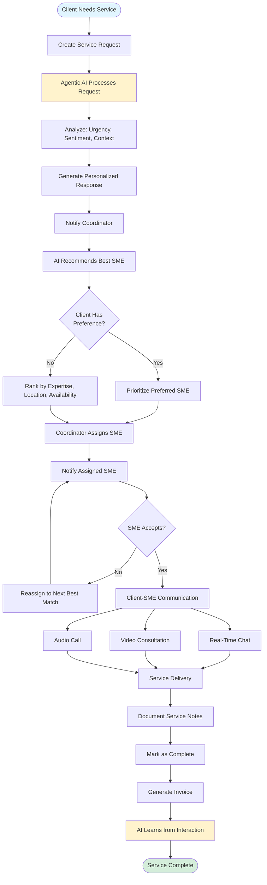
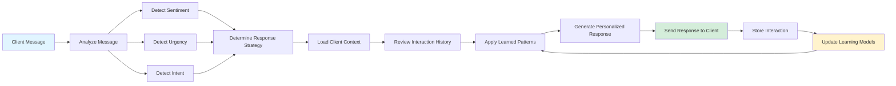
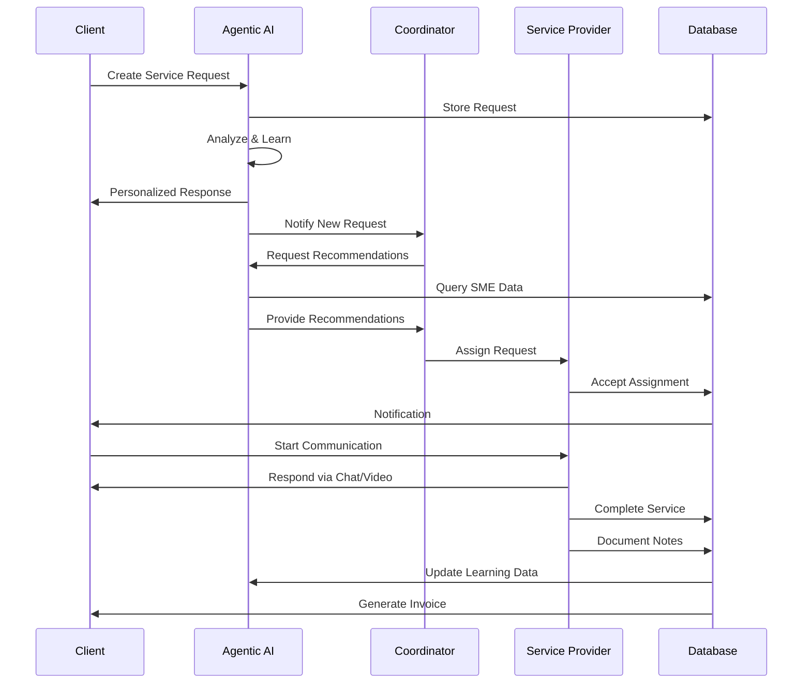
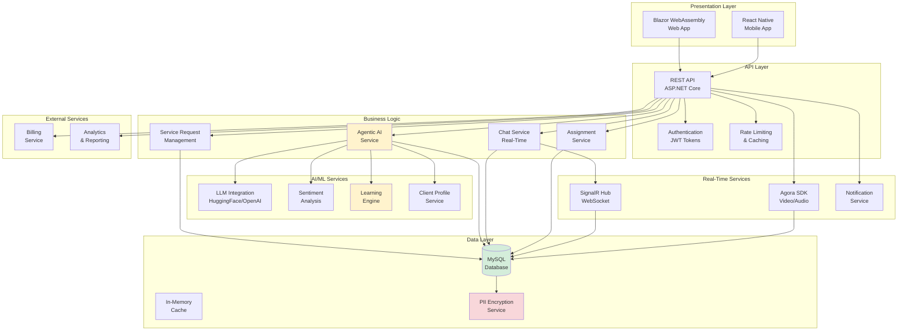
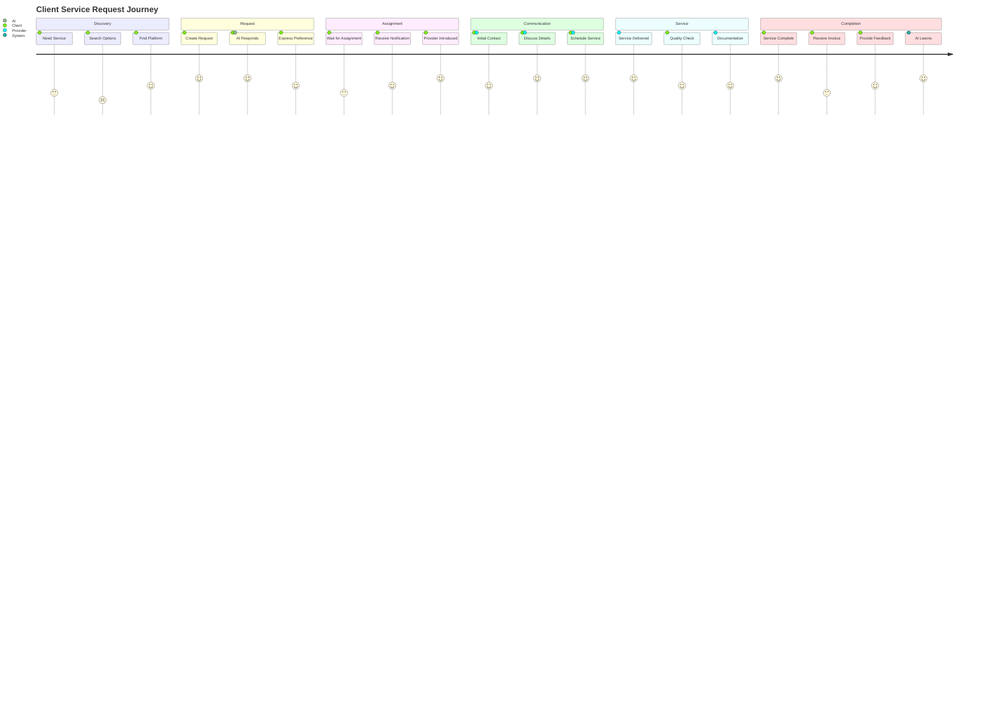
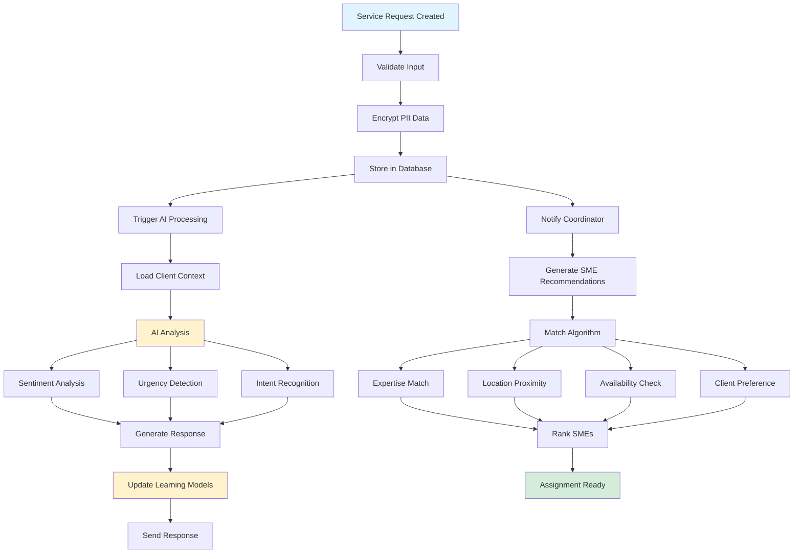
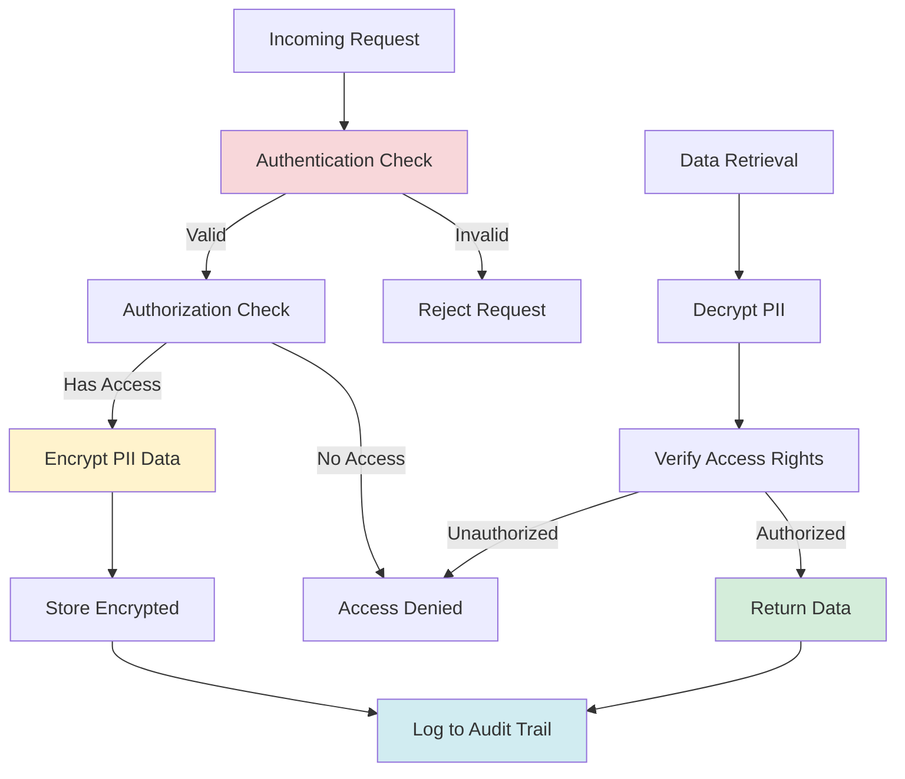
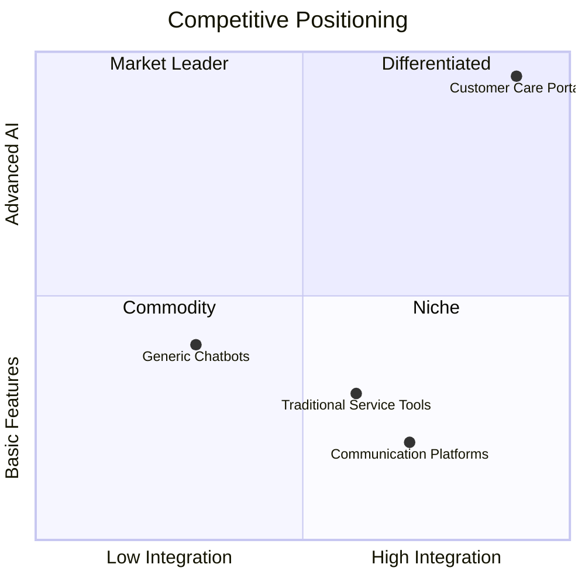

# Customer Care Portal - Workflow Diagrams

## Complete Service Request Lifecycle

---

## Agentic AI Learning Cycle

---

## Multi-Role Interaction Flow

---

## System Architecture - Detailed

---

## Client Journey Map

---

## Data Flow - Service Request Processing

---

## Security & Privacy Flow

---

## Competitive Advantage Matrix

---

## Usage Instructions

These Mermaid diagrams can be:

1. **Rendered in GitHub**: Simply view the markdown file on GitHub
2. **Exported to Images**: Use [Mermaid Live Editor](https://mermaid.live) to export as PNG/SVG
3. **Converted to Presentations**: Use tools like [Mermaid-to-PPT](https://github.com/mermaid-js/mermaid) or import into presentation software
4. **Embedded in Websites**: Use Mermaid.js library to render on web pages
5. **Printed Materials**: Export high-resolution images for print

### Recommended Tools for Visual Creation:
- **Draw.io**: Import Mermaid syntax or recreate visually
- **Lucidchart**: Professional diagramming
- **Figma**: For polished, branded visuals
- **PowerPoint/Keynote**: For presentation versions

---

*These workflow diagrams provide a comprehensive visual representation of the system's architecture, processes, and competitive positioning. Use them as the foundation for creating professional marketing and sales materials.*
